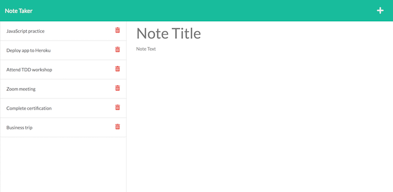

# Take-notes
  
This is an Express-powered note taking app.  
Users can write a new note by clicking the "+" icon on the top right of the notes page.  
From there, they can input a valid title and text, then by clicking the save button, notes will be seen on the left column.  
It is then possible to edit, delete and/or create more notes. 

## User Story

```
AS A small business owner
I WANT to be able to write and save notes
SO THAT I can organize my thoughts and keep track of tasks I need to complete
```

## Links

Repo: https://github.com/mz0121coder/Take-notes  

Live site: https://take-notes-online.herokuapp.com/

## Demo 


## Screenshot



